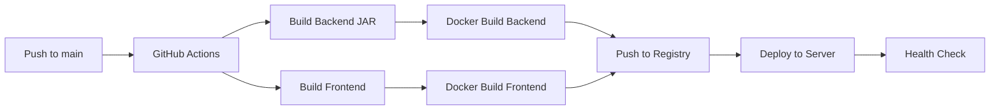

# Deployment Guide — CorpCare

## Architecture (Production)

```
                         Internet
                            │
                            ▼
                      ┌──────────┐
                      │  Nginx   │  Port 80/443
                      │  (proxy) │
                      └────┬─────┘
                           │
            ┌──────────────┼──────────────┐
            │              │              │
            ▼              ▼              ▼
      ┌──────────┐  ┌──────────┐  ┌──────────┐
      │ Frontend │  │ Backend  │  │  MySQL   │
      │  Nginx   │  │ Spring   │  │    8.0   │
      │ :3000    │  │ Boot     │  │ :3306    │
      └──────────┘  │ :8080    │  └──────────┘
                    └──────────┘
```

## Docker Compose Stack

```yaml
services:
  db:
    image: mysql:8.0
    volumes: mysql-data:/var/lib/mysql
    environment:
      MYSQL_DATABASE: corpcare

  backend:
    build: ./corpcare
    depends_on: [db]
    environment:
      SPRING_DATASOURCE_URL: jdbc:mysql://db:3306/corpcare
      TWILIO_ACCOUNT_SID: ${TWILIO_ACCOUNT_SID}
      TWILIO_AUTH_TOKEN: ${TWILIO_AUTH_TOKEN}
      TWILIO_WHATSAPP_FROM: ${TWILIO_WHATSAPP_FROM}
      BOLNA_API_KEY: ${BOLNA_API_KEY}
      BOLNA_AGENT_ID: ${BOLNA_AGENT_ID}

  frontend:
    build: ./corpcare-ui
    ports: ["3000:80"]
    depends_on: [backend]
```

## Environment Variables

| Variable | Description | Required |
|----------|-------------|----------|
| `DB_PASSWORD` | MySQL root password | Yes |
| `TWILIO_ACCOUNT_SID` | Twilio account SID | For WhatsApp |
| `TWILIO_AUTH_TOKEN` | Twilio auth token | For WhatsApp |
| `TWILIO_WHATSAPP_FROM` | WhatsApp sender number | For WhatsApp |
| `BOLNA_API_KEY` | Bolna.ai API key | For Voice |
| `BOLNA_AGENT_ID` | Bolna agent UUID | For Voice |

## CI/CD Pipeline



## Manual Deployment (Docker)

```bash
# 1. Clone
git clone https://github.com/your-org/corpcare.git
cd corpcare

# 2. Set env vars
export DB_PASSWORD=secure_password
export TWILIO_ACCOUNT_SID=...
export TWILIO_AUTH_TOKEN=...
export TWILIO_WHATSAPP_FROM=+14155238886
export BOLNA_API_KEY=...
export BOLNA_AGENT_ID=...

# 3. Start
docker compose up -d --build

# 4. Verify
docker compose ps
docker compose logs backend
```

## Server Requirements

| Resource | Minimum | Recommended |
|----------|---------|-------------|
| CPU | 1 core | 2 cores |
| RAM | 2 GB | 4 GB |
| Disk | 10 GB | 20 GB (SSD) |
| OS | Ubuntu 22.04 | Ubuntu 24.04 |
| Docker | 24+ | 27+ |
| Docker Compose | v2 | v2 |

## Monitoring

- Health check: `GET /api/actuator/health` (when Spring Actuator is added)
- Logs: `docker compose logs -f`
- Database: `docker compose exec db mysql -u root -p corpcare`

## Backup

```bash
# Database backup
docker compose exec db mysqldump -u root -p${DB_PASSWORD} corpcare > backup_$(date +%Y%m%d).sql

# Restore
cat backup.sql | docker compose exec -T db mysql -u root -p${DB_PASSWORD} corpcare
```

## Future Improvements

- Add Spring Actuator for production health checks
- SSL termination via Let's Encrypt + Certbot
- Prometheus + Grafana monitoring
- Centralized logging (ELK stack)
- Horizontal scaling for backend (session affinity)
- CDN for static assets
- Blue-green deployment strategy
